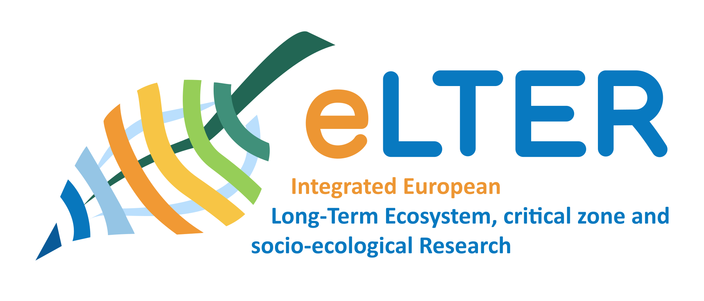

  

# eLTER-data-standarization
This repository is intended to work towards the standardization of eLTER terms vocabulary.

## Authors

| Author | | Affiliation | ORCID | e-mail |
| :---: | :---: | :---: | :---: | :---: |
| Allan T. Souza | | [University of Helsinki](https://ror.org/040af2s02) | [0000-0002-1851-681X](https://orcid.org/0000-0002-1851-681X) | [allan.souza\@helsinki.fi](mailto:allan.souza@helsinki.fi) |
| Sarah Venier |  | [Environmental Agency Austria](https://ror.org/013vyke20) | [?](?) | [sarah.venier\@umweltbundesamt.at](mailto:sarah.venier@umweltbundesamt.at) |
| Johannes Peterseil |  | [Environmental Agency Austria](https://ror.org/013vyke20) | [0000-0003-0631-8231](https://orcid.org/0000-0003-0631-8231) | [johannes.peterseil\@umweltbundesamt.at](mailto:johannes.peterseil@umweltbundesamt.at) |

## Goals
To map the terms currently in use in eLTER, compare it with terms used in standard data vocabularies and ontologies.

## Status
In development.

## License 
This project is licensed under the [EUPL License](https://eupl.eu/) - see the [LICENSE](LICENSE) file for details.

## Potentially useful R packages
 - https://github.com/ropensci/EML
 - https://github.com/ropensci/dwctaxon
